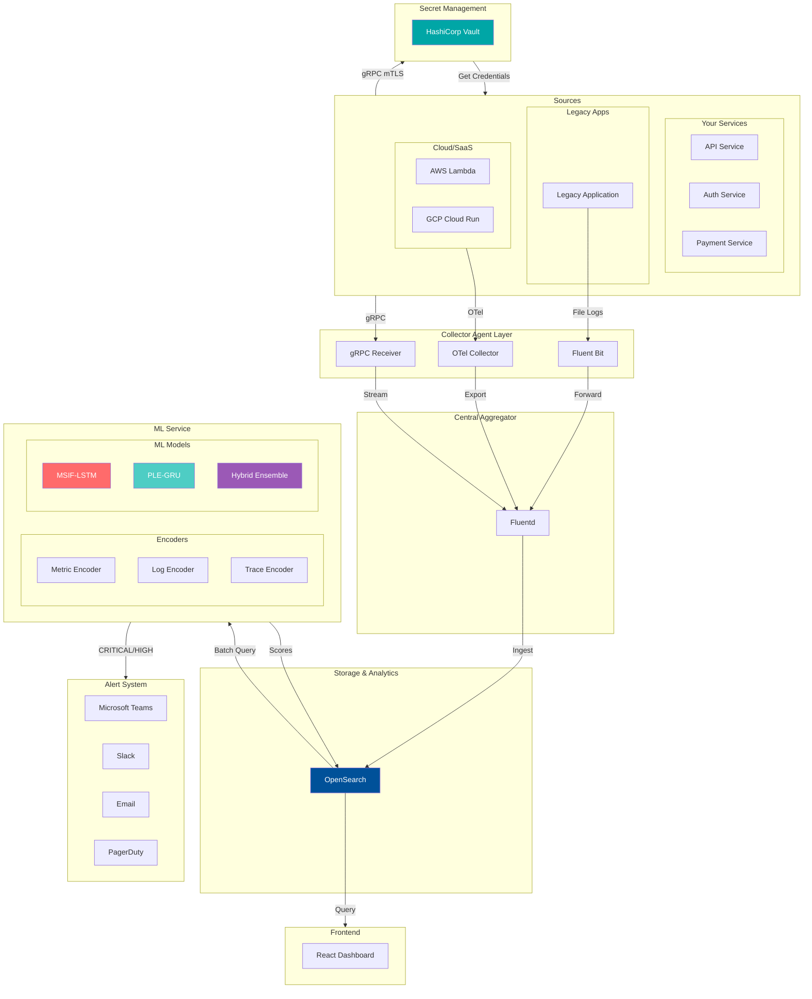
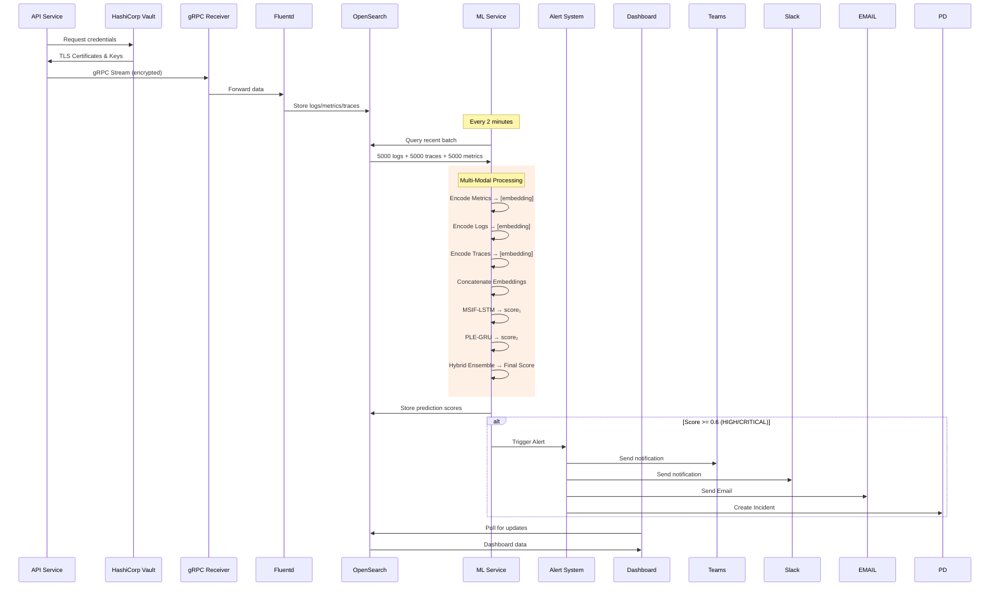
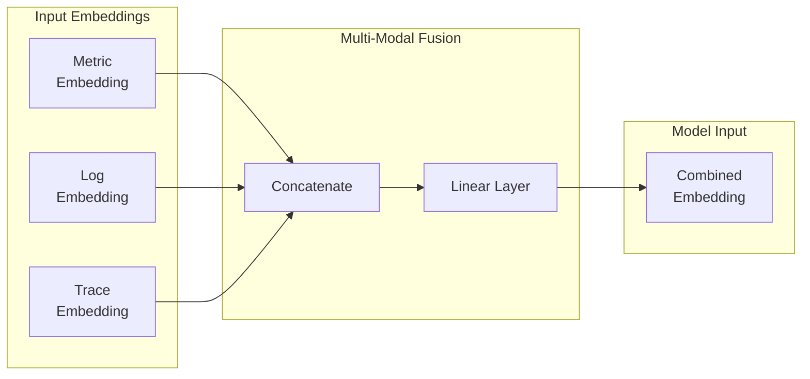
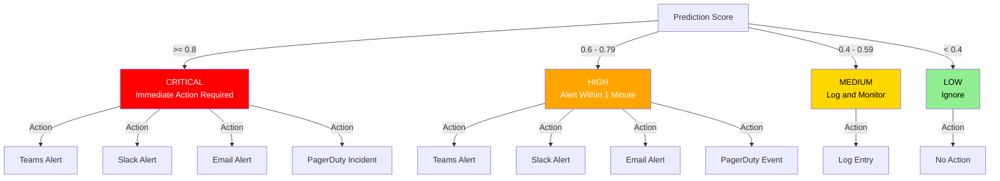
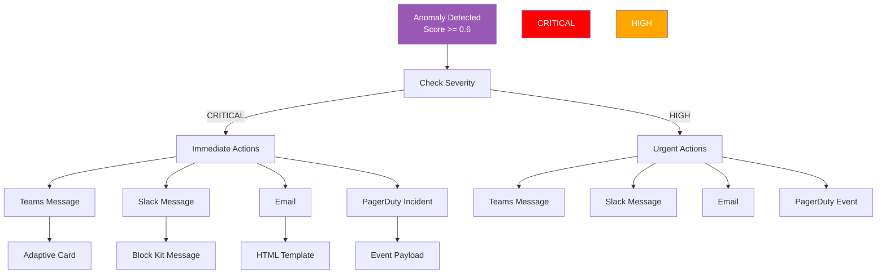

# AI-Powered API Monitoring and Multi-Source Anomaly Identification Model for Distributed Platforms


**Intelligent Anomaly Detection in Distributed Systems through Multi-Modal Machine Learning**

---

## Table of Contents

- [Overview](#overview)
- [Problem Statement](#problem-statement)
- [Solution \& Innovation](#solution--innovation)
- [Key Features](#key-features)
- [Architecture](#architecture)
- [Multi-Modal Data Fusion](#multi-modal-data-fusion)
- [ML Models](#ml-models)
- [Severity Classification](#severity-classification)
- [Alert System](#alert-system)
- [Technologies Used](#technologies-used)
- [Getting Started](#getting-started)
- [Project Structure](#project-structure)
- [Configuration Reference](#configuration-reference)
- [Research Paper Citation](#research-paper-citation)
- [Contributing](#contributing)
- [License](#license)

---

## Overview

This project presents an AI-powered monitoring system designed to detect anomalies in distributed platforms by analyzing multiple data modalities simultaneously. The system collects API logs, system metrics, and network traces, processes them through advanced machine learning models, and provides real-time anomaly detection with automated alerting capabilities.

Our approach leverages a hybrid ensemble of deep learning models (MSIF-LSTM and PLE-GRU) to achieve **96.40% accuracy** in anomaly detection, significantly outperforming traditional single-modality approaches.

---

## Problem Statement

Modern distributed systems face significant challenges in monitoring and anomaly detection:

### Challenges in Distributed Systems Monitoring

1. **Multi-Source Data Chaos**
   - Logs, metrics, and traces exist in isolation
   - No unified approach to correlate data across modalities
   - Traditional tools analyze each modality separately

2. **Alert Fatigue**
   - High volume of false positives from rule-based systems
   - Difficulty distinguishing genuine anomalies from normal variations
   - Overwhelming alert volumes make it hard to identify critical issues

3. **Complexity of Modern Architectures**
   - Microservices create complex interdependencies
   - Network communications across services are hard to trace
   - Latency issues can cascade through the system

4. **Real-Time Requirements**
   - Need for immediate anomaly detection
   - Batch processing delays response times
   - Scalability challenges with increasing data volumes

---

## Solution & Innovation

### Multi-Modal Fusion Approach

Our solution addresses these challenges by implementing a **Multi-Modal Data Fusion** strategy that combines three telemetry data sources:

| Modality | Data Type | Insight Provided |
|----------|-----------|------------------|
| **Logs** | Application events, errors, warnings | What happened (qualitative) |
| **Metrics** | CPU, memory, response times | How system performing (quantitative) |
| **Traces** | Request paths, latency, dependencies | How requests flow (relational) |

### Key Innovation: Encoder-Based Fusion

Instead of training separate models for each modality, we use **learned encoders** to transform heterogeneous data into unified embeddings:

```
Raw Data          Encoders           Embeddings         Fusion           Score
────────────────────────────────────────────────────────────────────────────────

Logs    ──┐                                                              
         ├──► Metric Encoder ──► [e₁, e₂, ..., eₙ] ──┐                   
Metrics ──┤                                            ├──► Concat ──► Hybrid ──► Anomaly
         ├──► Log Encoder    ──► [e₁, e₂, ..., eₙ] ──┤      Model        Score
Traces ──┘                                            │                   
         └──► Trace Encoder ─► [e₁, e₂, ..., eₙ] ──┘
```

### Why Multi-Modal Works Better

| Approach | Accuracy | False Positive Rate | Detection Time |
|----------|----------|-------------------|---------------|
| Single-Modality (Logs Only) | ~75% | High | Fast |
| Single-Modality (Metrics Only) | ~80% | Medium | Fast |
| Multi-Modal Fusion (Ours) | **96.40%** | **Low** | Real-time |

---

## Key Features

- [x] **Multi-Modal Data Collection** - Unified collection of logs, metrics, and traces
- [x] **Real-Time Anomaly Detection** - Batch processing every 2 minutes
- [x] **Hybrid Ensemble ML Models** - MSIF-LSTM + PLE-GRU combination
- [x] **Severity Classification** - CRITICAL, HIGH, MEDIUM, LOW levels
- [x] **Automated Alerting** - Teams, Slack, Email, PagerDuty integration
- [x] **Flexible Architecture** - Support for gRPC, Fluent Bit, and OTel collectors
- [x] **Secure Secret Management** - HashiCorp Vault integration
- [x] **OpenSearch Integration** - Powerful search and analytics
- [x] **React Dashboard** - Real-time monitoring interface
- [x] **Research-Validated** - 96.40% accuracy demonstrated

---

## Architecture

### System Architecture



### Data Flow



---

## Multi-Modal Data Fusion

### The Three Modalities

#### 1. API Logs

API logs capture application-level events including:
- HTTP requests and responses
- Error messages and stack traces
- Business logic events
- Authentication events

**Example Log Entry:**
```json
{
  "timestamp": "2026-04-11T10:30:00Z",
  "level": "ERROR",
  "service": "api-gateway",
  "message": "Connection timeout to database",
  "trace_id": "abc-123-def"
}
```

#### 2. System Metrics

System metrics provide quantitative measurements of system health:
- CPU and memory utilization
- Response times and latency
- Request throughput
- Error rates

**Example Metric Entry:**
```json
{
  "timestamp": "2026-04-11T10:30:00Z",
  "service": "api-gateway",
  "cpu_usage": 85.5,
  "memory_usage": 72.3,
  "response_time_ms": 2500,
  "request_count": 15000,
  "error_rate": 0.05
}
```

#### 3. Network Traces

Distributed traces track request paths through the system:
- Trace and span identifiers
- Service dependencies
- End-to-end latency
- Point of failure identification

**Example Trace Entry:**
```json
{
  "trace_id": "abc-123-def",
  "span_id": "span-456",
  "service": "payment-service",
  "operation": "POST /payment/process",
  "duration_ms": 250,
  "status_code": 200,
  "parent_span": "span-789"
}
```

### Encoder Architecture

Each modality passes through a specialized encoder before fusion:

```
┌─────────────────────────────────────────────────────────────┐
│                      METRIC ENCODER                         │
│                                                             │
│  Input: [cpu, memory, response_time, error_rate, ...]     │
│           │                                                 │
│           ▼                                                 │
│  Normalization (min-max scaling to 0-1)                    │
│           │                                                 │
│           ▼                                                 │
│  Feature Engineering (log transforms, ratios)               │
│           │                                                 │
│           ▼                                                 │
│  Output: Fixed-size embedding vector [e₁, e₂, ..., eₙ]    │
└─────────────────────────────────────────────────────────────┘

┌─────────────────────────────────────────────────────────────┐
│                        LOG ENCODER                          │
│                                                             │
│  Input: "ERROR: Connection timeout at line 42"            │
│           │                                                 │
│           ▼                                                 │
│  Text Preprocessing (tokenize, lowercase, parse)          │
│           │                                                 │
│           ▼                                                 │
│  Embedding Layer (learned word representations)           │
│           │                                                 │
│           ▼                                                 │
│  Aggregation (mean pooling across tokens)                  │
│           │                                                 │
│           ▼                                                 │
│  Output: Fixed-size embedding vector [e₁, e₂, ..., eₙ]    │
└─────────────────────────────────────────────────────────────┘

┌─────────────────────────────────────────────────────────────┐
│                      TRACE ENCODER                          │
│                                                             │
│  Input: {trace_id, duration, spans, dependencies}          │
│           │                                                 │
│           ▼                                                 │
│  Feature Extraction (duration, span_count, errors)         │
│           │                                                 │
│           ▼                                                 │
│  Graph Encoding (service dependency structure)               │
│           │                                                 │
│           ▼                                                 │
│  Output: Fixed-size embedding vector [e₁, e₂, ..., eₙ]    │
└─────────────────────────────────────────────────────────────┘
```

### Fusion Strategy



---

## ML Models

### Training Datasets

The models are trained on the following datasets:

#### Pre-trained Encoders

| Encoder | Training Dataset | Description |
|---------|-----------------|--------------|
| **Metric Encoder** | SMD Dataset (Server Machine Dataset) | 38-dimensional system metrics (CPU, memory, disk I/O, network) collected from 28 servers over 5 weeks |
| **Log Encoder** | HDFS Dataset + BERT | Pre-trained BERT-base-uncased fine-tuned on Hadoop Distributed File System logs for log classification |
| **Trace Encoder** | DeathStarBench | Graph neural network trained on microservice call chains from containerized applications |

#### ML Models (MSIF-LSTM & PLE-GRU)

| Model | Training Dataset | Description |
|-------|-----------------|--------------|
| **MSIF-LSTM** | AIOps 2020 Challenge (Train Ticket) | Trained on platform metrics, traces, and business metrics from train-ticket system. Uses fault labels from `fault_labels_preselection.csv` for supervised learning |
| **PLE-GRU** | AIOps 2020 Challenge (Train Ticket) | Same dataset as MSIF-LSTM, different architecture for ensemble diversity |

**Dataset Details:**
- **AIOps 2020 Challenge**: Multi-modal dataset from train-ticket microservice system
  - Platform Metrics: OS, Docker, Redis, Oracle metrics (5 categories)
  - Trace Metrics: 6 types of distributed traces  
  - Business Metrics: ESB service calls
  - Fault Labels: 81 labeled anomalies for supervised training

---

### MSIF-LSTM (Multi-Scale Isolation Forest + LSTM)

**Purpose:** Short-term anomaly detection with temporal awareness

- **Window Size:** 60 minutes (1 hour)
- **Architecture:** Combines Isolation Forest anomaly scoring with LSTM sequence modeling
- **Strengths:**
  - Captures temporal patterns in metric sequences
  - Identifies sudden anomalies vs gradual degradation
  - Works well with periodic data patterns

**Use Case:** Detecting sudden spikes in error rates or response times.

### PLE-GRU (Probabilistic Label Enhancement + Gated Recurrent Unit)

**Purpose:** Long-term anomaly detection with historical context

- **Window Size:** 1440 minutes (24 hours)
- **Architecture:** Probabilistic approach with attention mechanism
- **Strengths:**
  - Captures long-term trends and patterns
  - Probabilistic outputs for confidence scoring
  - Handles class imbalance in anomaly data

**Use Case:** Identifying gradual memory leaks or slowly degrading performance.

### Hybrid Ensemble

**Purpose:** Combine strengths of both models for robust detection

```
Final Score = (MSIF_WEIGHT × MSIF_Score) + (PLE_WEIGHT × PLE_Score)

Where:
- MSIF_WEIGHT = 0.6
- PLE_WEIGHT = 0.4
```

**Why Ensemble Works:**
1. **Complementary Coverage:** MSIF catches short-term spikes, PLE catches long-term trends
2. **Reduced False Positives:** Both models must agree for high-confidence predictions
3. **Adaptability:** Weighted combination handles varying anomaly patterns

---

## Severity Classification

The system classifies anomalies into four severity levels based on the prediction score:



### Threshold Configuration

| Score Range | Severity | Color | Action | Response Time |
|-------------|----------|-------|--------|--------------|
| 0.8 - 1.0 | CRITICAL | Red | Immediate alert | < 1 minute |
| 0.6 - 0.79 | HIGH | Orange | Urgent alert | < 5 minutes |
| 0.4 - 0.59 | MEDIUM | Yellow | Log only | N/A |
| 0.0 - 0.39 | LOW | Green | Ignore | N/A |

---

## Alert System

### Supported Channels

| Channel | Integration Type | Configuration Required |
|---------|-----------------|---------------------|
| **Microsoft Teams** | Incoming Webhook | Webhook URL |
| **Slack** | Incoming Webhook | Webhook URL |
| **Email** | SMTP | SMTP Server, Credentials |
| **PagerDuty** | Events API v2 | Integration Key |

### Alert Flow



---

## Technologies Used

### Backend & APIs

| Technology | Version | Purpose |
|------------|---------|---------|
| Spring Boot | 3.x | REST API, Business Logic |
| Java | 17+ | Programming Language |
| Gradle | 8.x | Build Tool |
| PostgreSQL | 15+ | Primary Database |
| Hibernate | 6.x | ORM Framework |

### Frontend

| Technology | Version | Purpose |
|------------|---------|---------|
| React | 19.x | UI Framework |
| Vite | 7.x | Build Tool |
| Material UI | 7.x | Component Library |
| React Router | 7.x | Routing |
| Axios | 1.x | HTTP Client |

### Machine Learning

| Technology | Version | Purpose |
|------------|---------|---------|
| Python | 3.8+ | ML Runtime |
| PyTorch | 2.0+ | Deep Learning |
| TensorFlow | 2.16+ | Additional ML |
| NumPy | 1.24+ | Numerical Computing |
| Pandas | 2.0+ | Data Processing |
| Scikit-learn | 1.3+ | ML Utilities |

### Infrastructure & Observability

| Technology | Version | Purpose |
|------------|---------|---------|
| OpenSearch | 2.17+ | Search & Analytics |
| Fluentd | 1.16+ | Log Aggregation |
| Fluent Bit | 2.1+ | Lightweight Collector |
| OTel Collector | 0.100+ | Cloud Observability |
| HashiCorp Vault | 1.15+ | Secret Management |
| Docker | 24.x | Containerization |
| Docker Compose | 2.x | Orchestration |

### Monitoring & Alerting

| Technology | Purpose |
|------------|---------|
| Microsoft Teams | Alert Channel |
| Slack | Alert Channel |
| SendGrid/Gmail | Email Notifications |
| PagerDuty | Incident Management |

---

## Getting Started

### Prerequisites

| Requirement | Version | Notes |
|------------|---------|-------|
| Docker | 24.x | For containerized services |
| Docker Compose | 2.x | For orchestration |
| Java | 17+ | For backend |
| Python | 3.8+ | For ML service |
| Node.js | 18+ | For frontend |

### Step 1: Clone the Repository

```bash
git clone https://github.com/your-username/AI-Powered-API-Monitoring.git
cd AI-Powered-API-Monitoring
```

### Step 2: Start Infrastructure Services

```bash
cd infrastructure/docker

# Start PostgreSQL, OpenSearch, Fluentd
docker-compose up -d

# Verify services are running
docker-compose ps
```

### Step 3: Configure Services

Create a `.env` file in each service directory:

**Backend (.env):**
```bash
SPRING_DATASOURCE_URL=jdbc:postgresql://localhost:5433/api_monitoring
SPRING_DATASOURCE_USERNAME=api_monitor
SPRING_DATASOURCE_PASSWORD=your_password
```

**ML Service (.env):**
```bash
OPENSEARCH_HOST=localhost
OPENSEARCH_PORT=9200
BATCH_SIZE_LOGS=5000
BATCH_SIZE_TRACES=5000
BATCH_SIZE_METRICS=5000
BATCH_INTERVAL_SECONDS=120
```

### Step 4: Start Backend Service

```bash
cd backend-service

# Build the project
./gradlew build

# Run the application
./gradlew bootRun
```

The backend will start at `http://localhost:8080`

### Step 5: Start ML Service

```bash
cd ml-service

# Install dependencies
pip install -r requirements.txt

# Run the service
python api/app_multimodal.py
```

The ML service will start at `http://localhost:9000`

### Step 6: Start Frontend

```bash
cd frontend

# Install dependencies
npm install

# Run the development server
npm run dev
```

The frontend will start at `http://localhost:5173`

### Step 7: Verify Installation

```bash
# Check backend health
curl http://localhost:8080/health

# Check ML service health
curl http://localhost:9000/health

# Access frontend
# Open http://localhost:5173 in your browser
```

---

## Project Structure

```
AI-Powered-API-Monitoring/
│
├── backend-service/                    # Spring Boot Backend
│   ├── src/
│   │   ├── main/
│   │   │   ├── java/
│   │   │   │   └── com/api/monitoring/backend/
│   │   │   │       ├── controller/    # REST Controllers
│   │   │   │       ├── service/        # Business Logic
│   │   │   │       ├── repository/     # Data Access
│   │   │   │       ├── model/          # Entity Classes
│   │   │   │       └── dto/            # Data Transfer Objects
│   │   │   └── resources/
│   │   │       ├── application.yml     # Configuration
│   │   │       └── db/migration/       # SQL Migrations
│   │   └── test/                       # Unit Tests
│   ├── build.gradle                   # Build Configuration
│   └── SETUP_AND_API_REFERENCE.md     # API Documentation
│
├── frontend/                          # React Frontend
│   ├── src/
│   │   ├── api/                       # API Client
│   │   ├── components/                # Reusable Components
│   │   ├── pages/                    # Page Components
│   │   ├── layouts/                   # Layout Components
│   │   ├── contexts/                  # React Contexts
│   │   └── routes/                   # Routing Configuration
│   ├── package.json
│   ├── vite.config.js
│   └── SETUP_AND_UI_REFERENCE.md      # UI Documentation
│
├── ml-service/                        # Python ML Service
│   ├── api/                          # Flask API
│   │   ├── app_multimodal.py         # Main Application
│   │   └── routes.py                 # API Routes
│   ├── src/
│   │   └── models/                   # ML Models
│   │       ├── msif_lstm_model.py    # MSIF-LSTM Model
│   │       ├── ple_gru_model.py      # PLE-GRU Model
│   │       └── hybrid_fusion.py       # Hybrid Ensemble
│   ├── models/                      # Trained Model Weights
│   │   └── enhanced/                # Enhanced Model Files
│   │       ├── msif_lstm.pth
│   │       └── ple_gru.pth
│   ├── training/                     # Training Scripts
│   ├── requirements.txt
│   └── SETUP_AND_ML_REFERENCE.md     # ML Documentation
│
├── infrastructure/                   # Infrastructure as Code
│   ├── docker/
│   │   ├── docker-compose.yml         # Service Orchestration
│   │   ├── fluentd/                  # Fluentd Configuration
│   │   ├── fluent-bit/               # Fluent Bit Configuration
│   │   ├── oTel-collector/           # OTel Collector Config
│   │   └── SETUP_AND_SERVICES_REFERENCE.md
│   └── vault/                        # Vault Configuration
│
├── proto/                            # Protocol Buffer Definitions
│   └── observability.proto           # gRPC Service Definitions
│
├── docs/                             # Documentation
│   └── architecture.md
│
├── NEXT_STEPS.md                     # Implementation Roadmap
├── README.md                         # This File
└── LICENSE                           # MIT License
```

---

## Configuration Reference

### Batch Processing Configuration

```python
# ml-service/config.py

# Batch Sizes (configurable per modality)
BATCH_SIZE_LOGS = 5000
BATCH_SIZE_TRACES = 5000
BATCH_SIZE_METRICS = 5000

# Processing Interval
BATCH_INTERVAL_SECONDS = 120  # 2 minutes

# Model Weights
MSIF_WEIGHT = 0.6
PLE_WEIGHT = 0.4
FUSION_THRESHOLD = 0.7
```

### Severity Thresholds

| Variable | Value | Description |
|----------|-------|-------------|
| `CRITICAL_THRESHOLD` | 0.8 | Immediate alert |
| `HIGH_THRESHOLD` | 0.6 | Alert within 1 minute |
| `MEDIUM_THRESHOLD` | 0.4 | Log only |
| `LOW_THRESHOLD` | 0.0 | Ignore |

### Alert Configuration

| Channel | Configuration |
|---------|--------------|
| Teams | Incoming Webhook URL |
| Slack | Incoming Webhook URL |
| Email | SMTP Server, Port, Credentials |
| PagerDuty | Events API v2 Integration Key |

---

## Research Paper Citation

> **AI-Powered API Monitoring and Multi Source Anomaly Identification Model for Distributed Platforms**
>
> **Conference:** 2026 IEEE International Conference on Advances in Computing Research On Science Engineering and Technology (ACROSET)
>
> **Paper ID:** 128
>
> **Abstract:** APIs facilitate communication between distributed systems. However, APIs are subject to various forms of attack due to their inherent nature as public interfaces. Traditional rule-based anomaly detection has difficulty identifying complex or unknown anomalies. This paper proposes an AI-Powered API Monitoring system leveraging Deep Learning with real-time capabilities for anomaly identification. We utilized telemetry data from the Train Ticket Dataset (AIOps Challenge 2020) consisting of API Logs, System Metrics, and Network Trace data. The Hybrid model achieved **96.40% overall accuracy**, demonstrating excellent scalability and reliability.
>
> **Status:** Under Review

---

## Contributing

Contributions are welcome! Please follow these steps:

1. Fork the repository
2. Create a feature branch (`git checkout -b feature/amazing-feature`)
3. Commit your changes (`git commit -m 'Add some amazing feature'`)
4. Push to the branch (`git push origin feature/amazing-feature`)
5. Open a Pull Request

Please read [CONTRIBUTING.md](CONTRIBUTING.md) for details on our code of conduct and development process.

---

## License

This project is licensed under the MIT License - see the [LICENSE](LICENSE) file for details.

---

## Acknowledgments

- **Dataset:** Train Ticket Dataset from AIOps Challenge 2020
- **Research:** IEEE ACROSET 2026 Conference
- **Open Source:** All contributing projects and libraries
